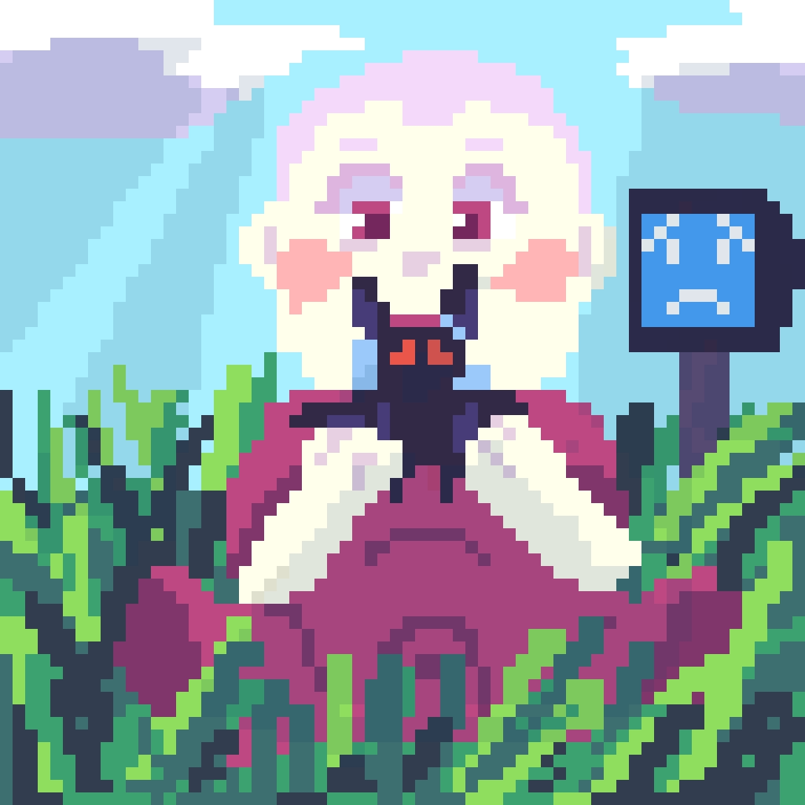

# 🌌 Neon Realms
**Onde as escolhas moldam o destino e o neon esconde a verdade.**

  

!
)

---

## 📜 A História (The Lore)

No ano de **2052**, o mundo é um reflexo da **Blends Corporation**. Sob o lema *"Moldando o Mundo, Moldando Você"*, a corporação controla a sociedade através de uma IA onipresente.

O conflito explode com os **Impuros**: seres de sangue roxo e habilidades sobre-humanas que buscam vingança. Você controla **Yuki**, um jovem preso entre o dever e o sangue, enfrentando seu próprio irmão, **Dusty**, o CEO da Blends.

---

## 🛠️ Destaques Técnicos (Technical Features)

Como um projeto de **Solo Developer**, utilizei a **GML (GameMaker Language)** para construir sistemas modulares:

* **💬 Diálogos Dinâmicos:** Árvores de decisão onde suas respostas alteram o destino de NPCs como Lilith e Tyler.
* **💡 Engine de Luz:** Sistema customizado de iluminação dinâmica para criar a atmosfera Cyber-Pixel.
* **🤖 IA de Combate:** Inimigos com máquinas de estado complexas que reagem às ações do jogador.
* **🎥 Smooth Camera:** Sistema de interpolação para movimentação cinematográfica da câmera.

---

## 🚀 Minha Evolução

Este repositório é um **marco temporal**. 
- **O Ontem:** Representa meu aprendizado autodidata no ensino médio, onde desbravei lógica, física 2D e design de jogos sozinho.
- **O Hoje:** Essa base de persistência me levou à **FIAP**, onde hoje desenvolvo sistemas escaláveis e IA (como o projeto **Elara**). Os commits antigos são o registro real de onde tudo começou.

---

## 🎮 Como Rodar

1. Clone o repositório.
2. Abra o arquivo `Neon Realms.yyp` no **GameMaker Suite**.
3. Pressione `F5` para iniciar o ambiente de teste.

---

## 📄 Licença e Direitos Autorais

  <strong>Copyright (c) 2026 Lucas Barreto. Todos os direitos reservados.</strong>

Este projeto é para fins de **exibição de portfólio técnico**. 
* **Permitido:** Estudo do código e avaliação por recrutadores.
* **Proibido:** Reprodução, redistribuição ou uso comercial de qualquer asset (arte, música, código ou roteiro) sem autorização prévia.

---

### 📫 Entre em contato:

*Developed with 💜 and Logic*

